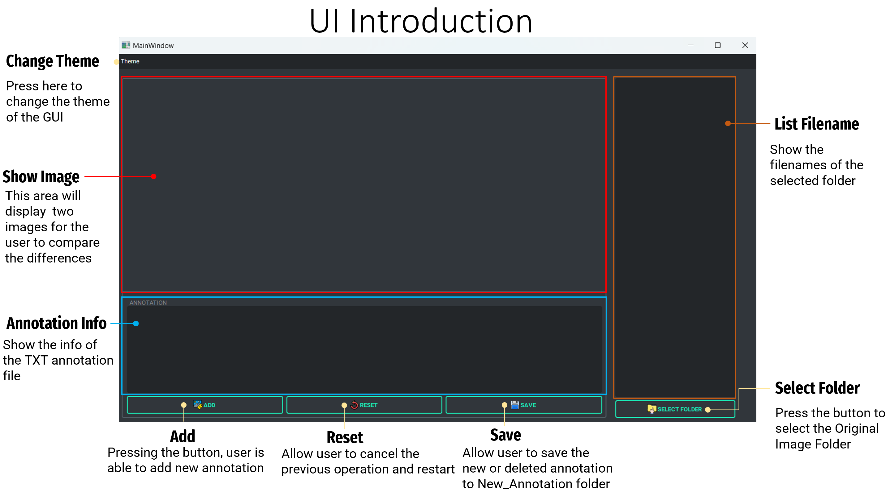

# YOLO Annotation Reviewing
The project allows user to edit the annotations in YOLO format(.txt).

## Installation
To use this project, you will need to have Python 3.8 or higher installed on your machine. You can install the required Python packages by running the following command:
<font color=#ACD6FF>
```
pip install -r requirements.txt
```
</font>
This will install all the required packages for running the project.

## Usage
THere are two ways to run this project. Please follow the following steps. 

*Method 1:*
1. Back to the previous folder  
2. Right click the <font color=#EA7500>**UI_Reviewing_for_YOLO**</font> and download the entire folder.
3. Unzip the downloaded folder and open it.
4. Double click the <font color=#EA7500>**Annotation_Review.exe**</font>
5. User can check <font color=#EA7500>**UI_User_Guide.pptx**</font> which covers more details.

*Method 2:*
1. Back to the previous folder  
2. Right click the <font color=#EA7500>**UI_Reviewing_for_YOLO**</font> and download the entire folder.
3. Unzip the downloaded folder and open it.
4. Open terminal 
5. Type  <font color=#ACD6FF>```cd Scripts/UI_code ```</font>
6. Type  <font color=#ACD6FF>```python main_control.py```</font>
8. User can check <font color=#EA7500>**UI_User_Guide.pptx**</font> which covers more details.

## File Structure
The project file structure is as follows:

```
UI_Reviwing_for_YOLO
├── Data
│   ├── Annotation
│   │   ├── 000001_00.txt
│   │   ├── 000056_00.txt
│   │   └── ...
│   ├── GroundTruth
│   │   ├── 000001_00.png
│   │   ├── 000056_00.png
│   │   └── ...
│   ├── OriginalImage
│   │   ├── 000001_00.png
│   │   ├── 000056_00.png
│   │   └── ...
│   ├── PredictedImage
│   │   ├── 000001_00.png
│   │   ├── 000056_00.png
│   │   └── ...
│   └── New_Annotation
│ 
├── Notebooks 
│   ├── folder.png
│   └── section_introduction.png
│   
├── Scripts
│   ├── UI_code
│   │   ├── __pycache__
│   │   │       └── UI_0216.cpython-310.pyc
│   │   ├── UI_Icons
│   │   │        └── annote.png
│   │   │        └── label.png
│   │   │        └── ...
│   │   ├── 000001_00.png
│   │   └── 000056_00.png
│   │ 
│   └── UI_Template
│       ├── version_4_0214.ui
│       └── version_4_0216.ui
│ 
├── README.md
├── UI_User_Guide.pptx
├── Annotation_Review.exe
└── requirements.txt
```
## Introduction



## Credits
This project was created by [JunKai-Liao]. If you use this project in your research, please cite it as follows:
```
[JunKai-Liao]. YOLO Annotation Reviewing. (2023). 
```
<!-- GitLab repository, https://gitlab.com/group-name/project-name. -->

