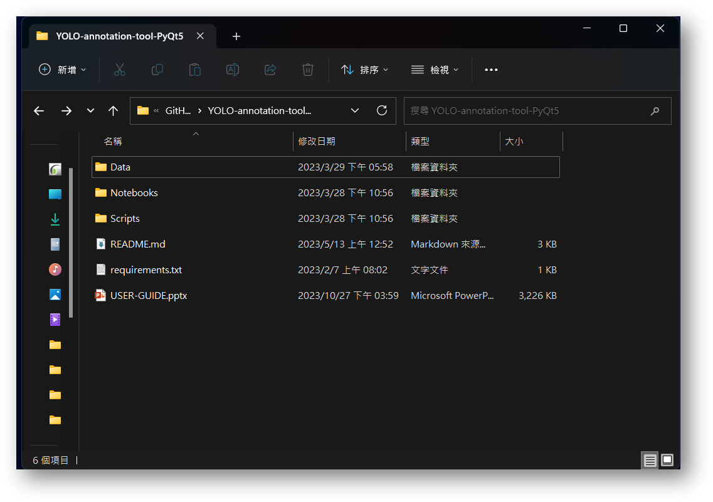
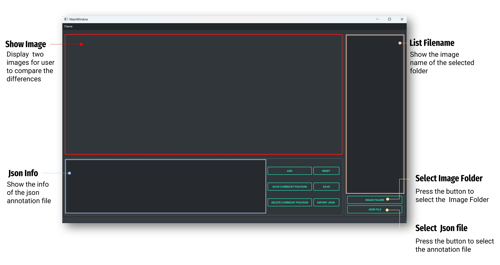
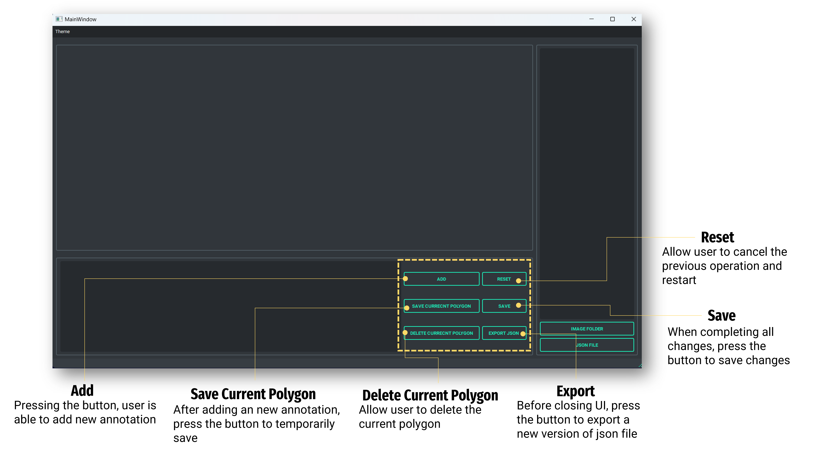

# YOLO Annotation Reviewing
The project allows user to edit the annotations in YOLO format(.txt).

## Installation
To use this project, you will need to have Python 3.8 or higher installed on your machine. You can install the required Python packages by running the following command:
<font color=#ACD6FF>
```
pip install -r requirements.txt
```
</font>
This will install all the required packages for running the project.

## Usage
1. Open terminal 
2. Type  <font color=#ACD6FF>```cd Scripts/UI_code ```</font>
3. Type  <font color=#ACD6FF>```python main_control.py```</font>
4. User can check <font color=#EA7500>**USER-GUIDE.pptx**</font> which covers more details.

## File Structure
The project file structure is as follows:

```
YOLO-annotation-tool-PyQt5
├── Data
│   ├── Annotation
│   │   ├── 000006_00.txt
│   │   ├── 000039_00.txt
│   │   └── 000042_00.txt
│   ├── GroundTruth
│   │   ├── 000001_00.png
│   │   ├── 000039_00.png
│   │   └── 000042_00.png
│   ├── OriginalImage
│   │   ├── 000006_00.png
│   │   ├── 000039_00.png
│   │   └── 000042_00.png
│   ├── Predict_Annotation
│   │   ├── 000006_00.txt
│   │   ├── 000039_00.txt
│   │   └── 000042_00.txt
│   ├── New_Annotation
|   └── JSON
|        └── Version0.json
│ 
├── Notebooks 
│   ├── folder.png
|   ├── section_introduction1.png
│   └── section_introduction2.png
│   
├── Scripts
│   ├── UI_code
│   │   ├── __pycache__
│   │   │       └── UI_0216.cpython-310.pyc
│   │   ├─ UI_Icons
│   │           └── annote.png
│   │           └── label.png
│   │           └── ...
│   │ 
│   └── UI_Template
│       ├── version_4_0214.ui
│       └── version_4_0216.ui
│       └── version_5_0329.ui
│       └── version_6_0329.ui
├── README.md
├── USER-GUIDE.pptx
└── requirements.txt
```
## Introduction




## Credits
This project was created by [JunKai-Liao]. If you use this project in your research, please cite it as follows:
```
[JunKai-Liao]. YOLO Annotation Reviewing. (2023). 
```
<!-- GitLab repository, https://gitlab.com/group-name/project-name. -->

